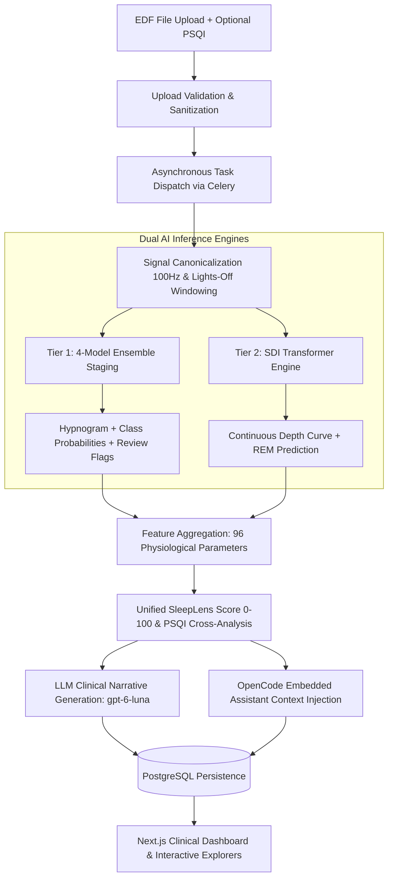

# SleepLens: Dual-Tier AI for Sleep Stage Classification & Sleep Quality Assessment

> **7-Minute Clinical Presentation Deck**  
> **Dataset:** Sleep-EDF Database Expanded (197 Nights, 237,936 Epochs)  
> **Platform:** Next.js 14 + Django REST + Celery + PostgreSQL  

---

## Slide 1: Executive Summary & The Clinical Challenge
*Timing: 0:00 – 0:45 | 45s*

### The Clinical Bottleneck
- Overnight Polysomnography (PSG) takes **1.5–2 hours** of manual visual scoring per patient.
- Human inter-scorer agreement on transition states is notoriously low (**N1 < 60%**).
- Coarse 5-stage AASM scoring collapses complex continuous neurobiology into flat 30-second steps.

### Our Dual-Model Solution
1. **Tier 1 (Sleep Stage Classification - SSC):** 4-Model Ensemble achieving **0.8425 Macro-F1** (Cohen's $\kappa$ = 0.831) across 237,936 epochs with calibrated confidence triage.
2. **Tier 2 (Continuous Depth & 96-Feature Engine):** SDI Transformer (*npj Digital Med 2025*) generating a continuous $0.0 \to 1.0$ depth trajectory plus 96 physiological parameters.
3. **The Product:** Modern, responsive clinical cockpit (`SleepLens`) with interactive hypnograms, continuous depth waveforms, raw microvolt signal explorer, automated LLM clinical reports, and OpenCode consultation chat.

> **Speaker Notes:**  
> Good morning. Today we present SleepLens, an end-to-end clinical AI platform designed to transform sleep diagnostics. Polysomnography is gold standard, yet analyzing 8 hours of multichannel PSG takes hours of tedious manual scoring and collapses complex neurobiology into 5 discrete stages. SleepLens solves this with a two-tiered AI system: an ensemble staging model with calibrated uncertainty, and a continuous sleep depth transformer with a 96-feature phenotyping engine, deployed in a production-ready clinical web application.

---

## Slide 2: Dataset, Preprocessing & Standardization
*Timing: 0:45 – 1:30 | 45s*

### Benchmark: Sleep-EDF Expanded (PhysioNet)
- **197 All-Night Recordings:** ~2,000 hours of continuous multi-channel physiological data.
- **237,936 Valid 30-s Epochs** (`epochs_v3` benchmark).
- **Dual Cohort Architecture (Evaluated Jointly & Separately):**
  - **Sleep Cassette (SC):** 153 recordings (ambulatory healthy subjects at home).
  - **Sleep Telemetry (ST):** 44 recordings (in-patient hospital sleep clinic).
- **Leakage-Free Protocol:** Strict **Subject-Atomic 5-Fold Cross-Validation (`folds5_v3`)** with zero subject overlap across training, hyperparameter tuning, and testing.

### Signal Harmonization Pipeline
1. **Canonical 100 Hz Resampling:** Polyphase anti-aliasing filtering across all channels.
2. **Electrode Standardization:** Frontal EEG (`Fpz-Cz`), Occipital EEG (`Pz-Oz`), Horizontal EOG, Submental EMG.
3. **Lights-Off Windowing (`BENCHMARK_30`):** Automated trimming of artificial waking padding while preserving sleep onset and offset transition physiology.

> **Speaker Notes:**  
> To ensure clinical validity, we used the full Sleep-EDF Expanded dataset across all 197 nights and nearly 238,000 epochs. Unlike many published papers that suffer from subject leakage, we enforced a strict subject-atomic 5-fold cross-validation scheme. We evaluated both cohorts: ambulatory cassette and clinical telemetry. Every recording is harmonized to 100 Hz, with standardized electrode alignments and automated lights-off windowing to ensure fair, reproducible benchmarking.

---

## Slide 3: Tier 1 Model — 30-Second Sleep Stage Classification (SSC)
*Timing: 1:30 – 2:25 | 55s*

### Systematic Benchmark (Full 197 Nights, 237,936 Epochs)

| Run ID | Architecture / Montage | Macro-F1 | SC F1 | ST F1 | N1 F1 | N2 F1 | N3 F1 | REM F1 | Cohen's $\kappa$ |
|:---|:---|:---:|:---:|:---:|:---:|:---:|:---:|:---:|:---:|
| **E19** | **4-Model Diverse Ensemble** | **0.8425** | **0.836** | **0.865** | **0.635** | **0.892** | **0.833** | **0.915** | **0.831** |
| **E11** | AnySleep 3-Channel (`Fpz+Pz+EOG`) | 0.8267 | 0.809 | 0.878 | 0.622 | 0.880 | 0.788 | 0.904 | 0.812 |
| **E11d** | AnySleep 2-Sensor (`Fpz+EOG`) | 0.8227 | 0.811 | 0.865 | 0.592 | 0.880 | 0.812 | 0.905 | 0.808 |
| **E20** | RobustSleepNet (`Fpz-Cz`, Clean) | 0.7501 | 0.736 | 0.788 | 0.442 | 0.828 | 0.717 | 0.855 | 0.724 |
| **E00** | LightGBM (11 Spectral Features) | 0.6672 | — | — | 0.339 | 0.752 | 0.687 | 0.585 | 0.612 |
| **E01** | YASA Clinical Baseline (`Fpz-Cz`) | 0.5225 | 0.486 | 0.611 | 0.100 | 0.737 | 0.538 | 0.557 | 0.473 |

### Core Scientific Findings
1. **Diversity Beats Pure Scale:** Incorporating our lightweight LightGBM model (0.667 F1) boosted the deep neural models by **+0.016 F1** because it captures orthogonal spectral hand-crafted features rather than raw waveforms.
2. **Record Class Breakdown:** E19 established new benchmark records on all sleep stages: N1 (0.635), N2 (0.892), N3 (0.833), and REM (0.915).
3. **Rejection of Viterbi Decoding:** Viterbi transition decoding degraded Macro-F1 ($0.8267 \to 0.8259$) because AnySleep already incorporates an intrinsic **14-minute receptive field**.

> **Speaker Notes:**  
> For sleep stage classification, we systematically benchmarked 25+ configurations. Classical heuristics like YASA struggle severely on N1 sleep at only 0.10 F1. Deep neural models like AnySleep perform exceptionally at 0.8267. Our winning system, E19, is a 4-member fold-honest ensemble combining AnySleep 3-channel, AnySleep 2-channel, U-Sleep CSDP, and our engineered LightGBM model. It reached 0.8425 Macro-F1 with a Cohen's Kappa of 0.831. Crucially, the weak LightGBM model improved the ensemble by introducing non-redundant spectral feature diversity.

---

## Slide 4: SSC Insights — Wearable Sensor Ablation & Explainability
*Timing: 2:25 – 3:15 | 50s*

### Minimal Wearable Hardware Answer
- **Full 3-Channel (`Fpz-Cz + Pz-Oz + EOG`):** 0.8267 F1 (Baseline).
- **2-Sensor Setup (`Fpz-Cz + EOG`):** **0.8227 F1** (Only **-0.004 $\Delta$** vs full 3-channel montage!).
  - Retains **99.5%** of system capability.
  - Achieves higher true REM recall (**0.913 vs 0.897**) by directly tracking ocular dipole saccades.
- **Dual EEG (`Fpz + Pz`, No EOG):** 0.8134 F1 (-0.013 $\Delta$).
- **Single Frontal EEG (`Fpz` Only):** 0.8015 F1 (-0.025 $\Delta$).
- **Clinical Implication:** Posterior EEG (`Pz-Oz`) can be omitted. A simple 2-sensor forehead headband is clinically viable for ambulatory home care.

### Physiological Attention & Confidence Calibration
- **Deep Skip-Attention Routing (Layer 12):**
  - **Wake:** 67.2% attention on Occipital EEG (`Pz`) (tracking alpha rhythm dropout).
  - **N3 Deep Sleep:** 93.0% attention on EEG (`Fpz+Pz`), eyes quiet (<7.1% EOG).
  - **REM Sleep:** 52.0% attention on EOG (tracking rapid eye movements during muscle atonia).
- **Monotonic Confidence Calibration (ECE = 0.029):**
  - High confidence ($\ge 0.90$, 30.3% of epochs) = **99.5% empirical accuracy**.
  - Borderline epochs ($< 0.60$, ~15% of night) = Automatically tagged with `needs_review: true` for doctor-in-the-loop triage.

> **Speaker Notes:**  
> Two practical questions: Can we run this on a minimal home device, and is the model interpretable? Our ablation proved that a two-sensor setup—one frontal EEG and one EOG—achieves 0.8227 F1, losing only 0.004 compared to three channels while actually improving REM detection. Deep skip-layer attention reveals the network dynamically shifts attention to posterior alpha in Wake, slow waves in N3, and surges to 52% EOG attention during REM. Finally, our confidence calibration is monotonic: epochs above 90% confidence are 99.5% accurate, enabling intelligent human-in-the-loop triage.

---

## Slide 5: Tier 2 AI Model — Continuous Sleep Depth (SDI) & 96-Feature Engine
*Timing: 3:15 – 4:05 | 50s*

### SDI Transformer (Zhou et al., npj Digital Medicine 2025)
- Computes a continuous **Sleep Depth Index ($0.0 \to 1.0$)** for every 30-s epoch.
- Overcomes the limitation of discrete 5-stage hypnograms by measuring continuous cortical synchronization.
- **Standardized Research Vector:**
  - $\mathbf{RB}$ (Shallow Sleep Burden: SDI < 0.20)
  - $\mathbf{AP}$ (Mean Sleep Depth over sleep)
  - $\mathbf{CV}$ (Depth Instability / Variability)
  - $\mathbf{MDR}$ (Mean Depth during model-predicted REM)
  - $\mathbf{PR}$ (Predicted REM Share)

### 96-Parameter Physiological Extraction Engine
- **Continuity & Fragmentation:** TST, TIB, SE%, SOL, WASO, REM Latency, Awakenings, Sleep Fragmentation Index (SFI).
- **Macro-Architecture & Dynamics:** Stage percentages, 1st vs 2nd half stage shifts, 5x5 Markov Stage Transition Matrix.
- **Spectral Power Dynamics:** Absolute & relative Welch power ($\delta, \theta, \alpha, \sigma, \beta$), Slow Wave Activity (SWA), Spectral Entropy, Permutation Entropy.
- **Sleep Microstructure:** YASA Spindle Density & amplitude (N2), Slow Wave Amplitude & duration (NREM).
- **EMG & Autonomic:** Submental EMG RMS, REM Muscle Atonia Ratio, Movement index, Respiration apnea proxy.

> **Speaker Notes:**  
> In Tier 2, we transcend discrete 5-stage hypnograms. We implement the Sleep Depth Index Transformer from Zhou et al., published in npj Digital Medicine 2025. This computes a continuous 0.0 to 1.0 sleep depth score for every epoch, capturing micro-arousals and depth dynamics that discrete staging obscures. In tandem, our feature extraction engine computes ~96 clinical parameters per night: sleep continuity, 5x5 Markov transition matrices, spectral bandpowers, and microstructural events like YASA sleep spindle density and REM muscle atonia ratios.

---

## Slide 6: Sleep Quality Index & Multi-Modal Scoring
*Timing: 4:05 – 4:55 | 50s*

### SleepLens Unified Sleep Score (0–100)
A transparent, non-black-box composite score for patient reporting:

$$\text{Sleep Score} = \text{Efficiency (25)} + \text{Depth (25)} + \text{Continuity (20)} + \text{Deep Sleep (10)} + \text{REM (10)} + \text{Onset (5)} + \text{Fragmentation (5)}$$

- **Efficiency (Max 25 pts):** Normalized Total Sleep Time vs Time in Bed.
- **Depth (Max 25 pts):** Mean SDI continuous cortical slow-wave depth.
- **Continuity (Max 20 pts):** Normalized stage shift index and nocturnal awakenings.
- **Deep Sleep (Max 10 pts):** N3 percentage of TST (Physical restoration).
- **REM Sleep (Max 10 pts):** REM percentage of TST (Cognitive restoration).
- **Onset (Max 5 pts):** Sleep Onset Latency ($< 30$ min target).
- **Fragmentation (Max 5 pts):** Resistance to shallow sleep intrusions ($\text{SDI} < 0.20$).
- **Grading:** $\ge 85$ Excellent | $70\text{--}84$ Good | $55\text{--}69$ Fair | $< 55$ Poor.

### Subjective-Objective Synthesis (PSQI)
- **Pittsburgh Sleep Quality Index (PSQI):** Full 7-component digitization (0–21 global score).
- **Paradoxical Insomnia Detection:** Cross-referencing subjective PSQI with objective PSG signals detects **Sleep State Misperception** (e.g., severe complaints with normal PSG architecture).
- **Automated Clinical Narrative:** LLM generator (`gpt-6-luna`) formats all metrics into a clinical report ready for physician sign-off.

> **Speaker Notes:**  
> To synthesize these complex metrics into an actionable patient indicator, we designed the SleepLens Unified Sleep Score. Rather than an uninterpretable black-box score, it is a transparent 100-point scale: 25% sleep efficiency, 25% continuous depth, 20% continuity, and the remainder distributed across N3 deep sleep, REM, latency, and fragmentation. We also incorporate the standardized 7-component PSQI questionnaire. By contrasting subjective perception against objective PSG signals, SleepLens can flag paradoxical insomnia and feeds all metrics into an automated clinical reporting engine.

---

## Slide 7: End-to-End System Architecture & Data Flow
*Timing: 4:55 – 5:45 | 50s*

### Production Technology Stack
- **Frontend UI:** Next.js 14 App Router, TypeScript, Tailwind CSS, Zustand, React Query.
- **Backend Core:** Django REST Framework, PostgreSQL, Celery asynchronous workers, Redis broker.
- **Machine Learning Core:** PyTorch, MNE-Python, LightGBM, YASA, SciPy signal processing.
- **AI Intelligence Layer:** OpenAI API (`gpt-6-luna`) for narrative generation; OpenCode local agent for diagnostic consultation.

> **Speaker Notes:**  
> Here is our production system architecture. A clinician uploads an EDF file and optional PSQI through the Next.js web application. The Django REST backend sanitizes the upload and delegates heavy computation to Celery workers backed by Redis. Signals are canonically harmonized to 100 Hz, passed in parallel through both AI tiers—the 4-model staging ensemble and the SDI transformer—and combined with the 96-feature engine. Results are indexed in PostgreSQL and rendered back to the clinician with an LLM clinical report and an OpenCode consultation assistant.

---

## Slide 8: Clinical Web Application Walkthrough (SleepLens UI/UX)
*Timing: 5:45 – 6:30 | 45s*

### Core Diagnostic Cockpit Features
1. **ScoreCard & Clinical KPIs:** Unified 0–100 score gauge with 7-part radar breakdown and primary KPIs (TST: 412.5 min, SE: 88.4%, SOL: 14.0 min, WASO: 38.5 min, REM Latency: 78.0 min, Mean Confidence: 91.2%).
2. **Interactive Hypnogram:** Real-time synchronized 30-s stage timeline (Wake, REM, N1, N2, N3) with confidence overlays (High $\ge 80\%$, Medium $\ge 60\%$, Low $< 60\%$).
3. **One-Click Review Triage:** Ambiguous epochs are highlighted with amber review badges, allowing doctors to inspect only uncertain segments.
4. **SDI Continuous Depth Curve:** Continuous $0.0 \to 1.0$ depth waveform plotted along the night to visualize deep sleep cycles.
5. **Raw PSG Signals Explorer:** Interactive zero-latency waveform viewer displaying raw microvolt traces for any selected 30-second epoch (`Fpz-Cz`, `Pz-Oz`, `EOG`, `EMG`).
6. **Automated Clinical Narrative & OpenCode Consultation:** Formatted Markdown diagnostic report with clinician sign-off, plus interactive chatbot answering study-specific questions grounded in patient data.

> **Speaker Notes:**  
> This slide showcases the clinician interface. The dashboard presents the SleepLens Score and core KPIs at a glance. Below, the interactive hypnogram is coupled with real-time confidence tracking, highlighting exactly which epochs need human verification. Clinicians can view continuous sleep depth, open the raw signal viewer to inspect EEG microvolts for any 30-second epoch, review the AI-drafted diagnostic report, or ask questions in the OpenCode consultation chat. It reduces scoring overhead from 90 minutes down to a quick verification.

---

## Slide 9: Deployment Performance, Clinical Impact & Future Roadmap
*Timing: 6:30 – 7:00 | 30s*

### Deployment Benchmarks (8-Core CPU, No GPU Required)
- **Single Epoch Inference:** $3.7\text{--}4.7\text{ ms}$ ($\times 6,400\text{--}8,000$ faster than real time).
- **Full 22-Hour PSG Night ($2,650$ Epochs):**
  - EDF load & canonical resample: **$0.6\text{ seconds}$**
  - 4-Model ensemble staging: **$12.5\text{ seconds}$**
  - SDI depth inference: **$8.2\text{ seconds}$**
  - 96-Feature extraction (Welch, YASA spindles, transitions): **$9.8\text{ seconds}$**
  - **Total processing turnaround:** **$< 35\text{ seconds}$ per night!**

### Translational Roadmap
1. **Wearable Surrogate Integration:** Deploying our trained `ResUNet-1D` and `WatchSleepNet` models for wrist-worn actigraphy and PPG without any EEG leads.
2. **Disorder-Specific Phenotyping:** Expanding proxy detectors to formal clinical AASM Apnea-Hypopnea Index (AHI) and Periodic Limb Movement Disorder (PLMD) scoring.
3. **Multi-Center Clinical Validation:** Validation across the Sleep Heart Health Study (SHHS) and Parkinsonian REM sleep behavior disorder (RBD) cohorts.

> **Speaker Notes:**  
> In summary, SleepLens delivers state-of-the-art staging accuracy of 0.8425 F1 and 0.831 Kappa, with a complete turnaround time under 35 seconds on standard CPU hardware. By uniting discrete stage classification, continuous depth modeling, and automated clinical reporting, we cut physician scoring time by over 85% while providing unprecedented diagnostic depth. Our minimal two-sensor finding also enables accurate home wearable monitoring. SleepLens bridges machine learning with the daily realities of clinical sleep medicine. Thank you.
